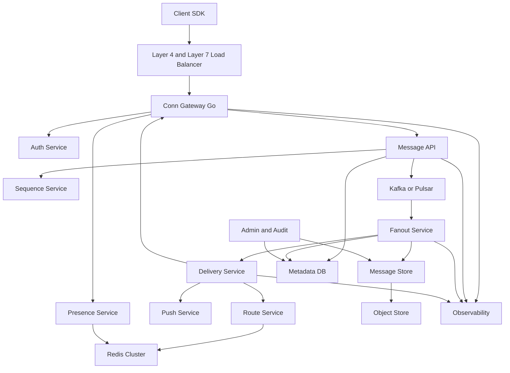
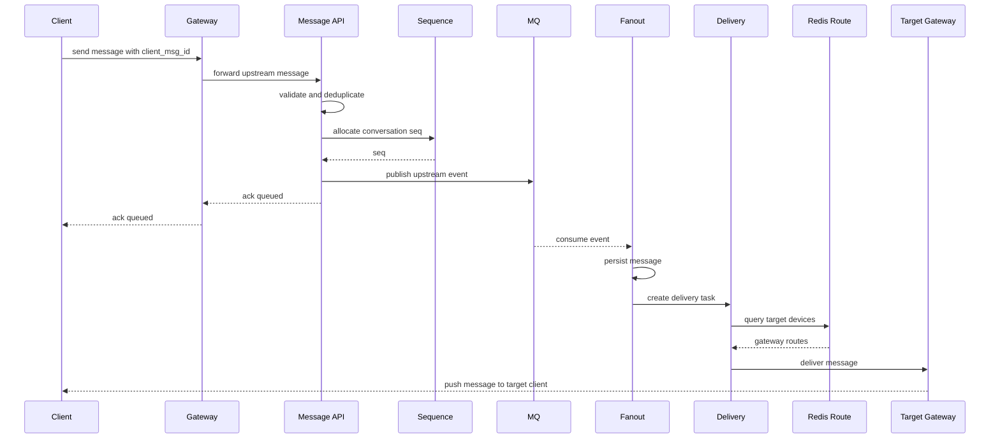
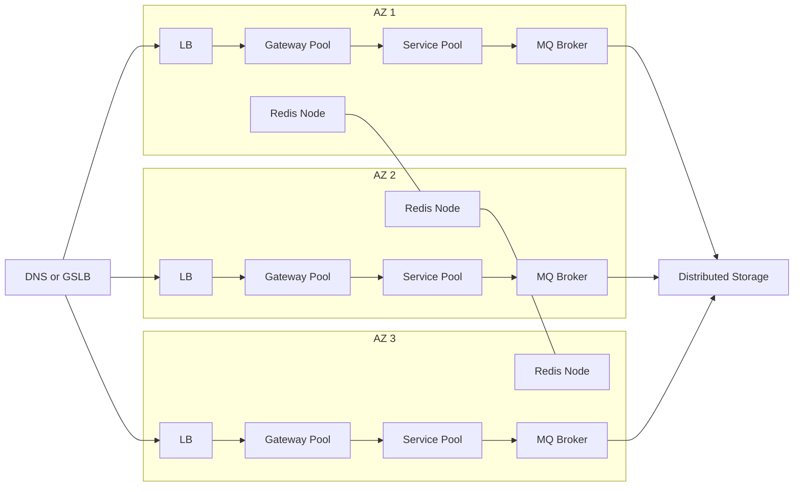
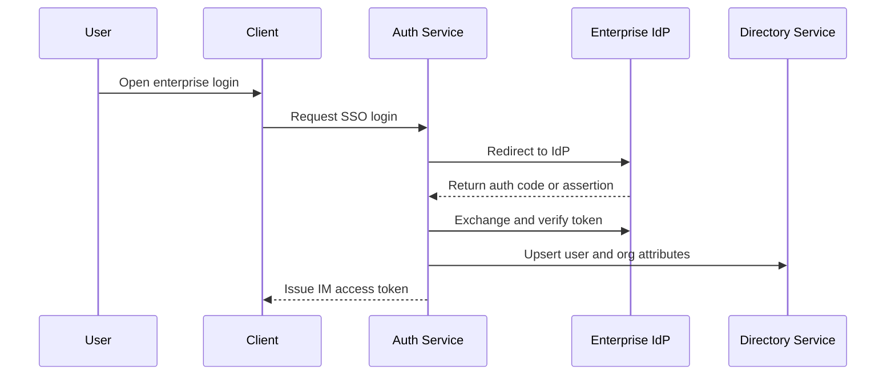

# 通用千万级 Golang IM 系统架构规划

> 规划口径：采用“从 MVP 到千万级演进”的路线，先落地支持 10 万在线和 1 万消息每秒的可运行系统，再通过分阶段架构改造扩展到百万在线、千万注册用户和峰值 10 万消息每秒。

## 1. 目标与边界

### 1.1 业务能力

默认支持：

- 单聊
- 群聊
- 离线消息
- 多端同步
- 已读回执
- 在线状态
- WebSocket 长连接
- TCP 长连接
- 水平扩容
- 多可用区部署

### 1.2 容量目标

#### MVP 阶段目标

- 注册用户：百万级可扩展设计
- 同时在线：10 万级
- 峰值消息吞吐：1 万消息每秒
- 单聊端到端延迟：P99 < 300ms
- 群聊端到端延迟：P99 < 800ms
- 可用性：先按 99.9% 到 99.95% 建设，关键组件避免单点
- 部署方式：单地域多可用区或预留多可用区架构

#### 终态扩展目标

- 注册用户：千万级
- 同时在线：百万级
- 峰值消息吞吐：10 万消息每秒
- 单聊端到端延迟：P99 < 300ms
- 群聊端到端延迟：P99 < 800ms
- 可用性：99.99%
- 部署方式：同城多可用区优先，后续可演进到异地多活

### 1.3 核心设计原则

- 连接层与业务层解耦。
- 写入链路以顺序、可靠、可追踪为优先。
- 读取链路以缓存、分页、冷热分层为优先。
- 在线投递和离线存储分离。
- 单聊强顺序，群聊按会话维度尽量有序。
- 所有服务无状态化或弱状态化，状态集中到 Redis、消息队列、持久化存储。
- 关键链路具备限流、降级、熔断、重试、幂等能力。
- 默认多可用区部署，避免单点。

## 2. 总体架构



## 3. 服务拆分

### 3.1 接入层 Conn Gateway

职责：

- 管理 WebSocket/TCP 长连接。
- 心跳检测、连接保活、断线检测。
- 协议编解码、压缩、加密、基础校验。
- 维护本机用户连接表。
- 接收客户端上行消息并转发到消息服务。
- 接收投递服务下行消息并推送到客户端。

建议：

- 使用 Go 实现高并发网络服务。
- WebSocket 可使用标准库升级或高性能框架；TCP 建议自定义二进制协议。
- 每个 Gateway 进程承载连接数需通过压测确定，规划时可按 2 万到 10 万连接每实例估算。
- 连接状态不要只存在本机，需要同步到 Redis 或专用路由表。
- Gateway 保持轻业务逻辑，只做接入、鉴权校验、转发和下行投递。

### 3.2 认证服务 Auth Service

职责：

- 登录态校验。
- Token 签发与刷新。
- 设备校验。
- 多端登录策略控制。

建议：

- 使用 JWT 或短期 Access Token + Refresh Token。
- Gateway 建连时做认证，业务服务内部使用服务间鉴权。
- 支持设备维度会话，例如 user_id + device_id + platform。

### 3.3 路由服务 Route Service

职责：

- 查询用户当前连接在哪些 Gateway 节点。
- 维护 user_id 到 gateway_id、conn_id、device_id 的映射。
- 为投递服务提供路由查询。

建议：

- Redis Cluster 存储在线路由。
- Gateway 上线、下线、心跳超时时更新路由。
- 需要处理 Gateway 异常退出后的脏路由清理。
- 可以用 TTL + Gateway 周期续约规避脏数据。

### 3.4 消息服务 Message API

职责：

- 接收客户端上行消息。
- 参数校验、权限校验、防刷限流。
- 生成 server_msg_id。
- 写入消息队列。
- 返回客户端 ACK。

建议：

- 上行链路采用 client_msg_id 做幂等。
- server_msg_id 使用 Snowflake、Sonyflake、Segment ID 或会话内序号组合生成。
- ACK 分级：收到 ACK、入队 ACK、持久化 ACK、对端送达 ACK。

### 3.5 序列号服务 Sequence Service

职责：

- 为会话分配递增 seq。
- 保证同一 conversation_id 下消息顺序。

建议：

- 单聊和普通群聊按 conversation_id 分片分配 seq。
- 热门群可拆分为逻辑分区，保证局部有序或服务端统一排序。
- seq 可采用 Redis Lua、数据库号段、独立内存号段服务 + 持久化 checkpoint。
- 消息排序建议使用 conversation_id + seq，而不是纯时间戳。

### 3.6 消息队列 Kafka or Pulsar

职责：

- 削峰填谷。
- 解耦上行接入、消息持久化、在线投递、离线处理、推送。
- 提供可回放能力。

建议：

- Topic 按业务拆分：im.upstream、im.persist、im.deliver、im.push、im.audit。
- Partition key 使用 conversation_id，确保同会话消息进入同分区以便顺序处理。
- 高峰 10 万消息每秒建议预留 2 到 3 倍容量。
- 消费端必须支持幂等，避免重复消费导致重复投递或重复入库。

### 3.7 Fanout Service

职责：

- 消费上行消息。
- 写消息存储。
- 扩散投递任务。
- 处理单聊、群聊不同 fanout 策略。

策略：

- 单聊：写一次消息，向收发双方多端扩散。
- 小群：写扩散或读扩散均可，推荐写消息主体 + 成员收件箱索引。
- 大群：读扩散优先，避免对每个成员写离线收件箱。
- 超大群：分层广播、在线优先、离线摘要或按需拉取。

### 3.8 Delivery Service

职责：

- 查询用户在线路由。
- 下发在线消息到对应 Gateway。
- 对离线用户写离线队列或收件箱索引。
- 处理投递 ACK、重试和过期。

建议：

- 在线投递通过 gRPC streaming 或内部 RPC 调用 Gateway。
- Delivery 到 Gateway 需要超时控制和失败重试。
- 对客户端投递需要 msg_id 去重。
- 每个设备独立维护最大已收到 seq、最大已读 seq。

### 3.9 Presence Service

职责：

- 在线、离线、忙碌、隐身等状态管理。
- 好友或会话成员状态订阅。
- 状态变更通知。

建议：

- 在线状态存 Redis，使用 TTL 续约。
- 状态订阅需要限流，避免状态风暴。
- 大群不建议广播每个成员在线状态，只提供聚合在线人数或按需查询。

### 3.10 Push Service

职责：

- 离线推送。
- APNs、FCM、厂商推送适配。
- 推送聚合、免打扰、频控。

建议：

- Push 与 IM 在线投递解耦。
- 推送内容需要遵守隐私策略，可只推送摘要。
- 支持延迟推送，避免用户短暂掉线时重复通知。

### 3.11 Admin and Audit

职责：

- 用户、群、消息管理。
- 封禁、撤回、敏感词、风控。
- 审计检索和合规留存。

建议：

- 审计链路独立消费 MQ，不阻塞主链路。
- 后台查询走专用索引或搜索引擎，避免影响消息主库。

## 4. 数据模型

### 4.1 用户与设备

核心字段：

- user_id
- account_id
- nickname
- avatar
- status
- created_at
- updated_at

设备字段：

- device_id
- user_id
- platform
- app_version
- push_token
- last_login_at
- last_active_at

### 4.2 会话 Conversation

核心字段：

- conversation_id
- conversation_type：single 或 group
- owner_id
- member_count
- last_msg_id
- last_seq
- updated_at

单聊 conversation_id 建议由双方 user_id 规范化生成，也可使用独立 ID。

### 4.3 群组 Group

核心字段：

- group_id
- owner_id
- name
- avatar
- member_count
- join_policy
- mute_policy
- created_at
- updated_at

群成员字段：

- group_id
- user_id
- role
- join_seq
- mute_until
- last_read_seq
- created_at

### 4.4 消息 Message

核心字段：

- msg_id
- conversation_id
- conversation_type
- sender_id
- sender_device_id
- seq
- client_msg_id
- msg_type
- payload
- status
- created_at

索引建议：

- conversation_id + seq
- sender_id + created_at
- msg_id
- client_msg_id + sender_id + device_id

### 4.5 用户收件箱 Inbox

核心字段：

- user_id
- device_id 可选
- conversation_id
- last_seq
- unread_count
- last_read_seq
- updated_at

对于大群，Inbox 可只维护会话级游标，不为每条消息写入每个成员的收件箱。

### 4.6 回执 Receipt

核心字段：

- conversation_id
- user_id
- device_id
- delivered_seq
- read_seq
- updated_at

单聊可展示详细已读状态；大群建议展示人数聚合，不建议保留每条消息的完整已读明细，除非业务强需求。

## 5. 存储选型

### 5.1 元数据存储

可选：MySQL 分库分表、PostgreSQL 分区、TiDB、CockroachDB。

推荐：

- 初期使用 MySQL 分库分表。
- 强调水平扩展和运维简化时可考虑 TiDB。
- 用户、群、关系、设备、会话元数据走关系型存储。

### 5.2 消息存储

可选：ScyllaDB、Cassandra、HBase、DynamoDB、TiDB、分片 MySQL。

推荐：

- 千万级用户和高写入消息场景推荐 ScyllaDB 或 Cassandra。
- 查询模式固定为 conversation_id + seq 分页，非常适合宽列存储。
- 消息正文大字段、图片、视频、文件放 Object Store，只在消息中保存 metadata 和 URL。

### 5.3 缓存和状态

推荐：Redis Cluster。

用途：

- 在线路由。
- Presence 状态。
- 热点会话缓存。
- 限流计数。
- 短期幂等表。
- seq 分配辅助。

### 5.4 搜索与审计

可选：Elasticsearch、OpenSearch、ClickHouse。

建议：

- 消息搜索使用 OpenSearch 或 Elasticsearch。
- 行为日志、审计分析使用 ClickHouse。
- 审计存储与主消息存储分离。

## 6. 消息链路设计

### 6.1 单聊上行链路



### 6.2 ACK 语义

建议支持四类 ACK：

- Client Send ACK：客户端确认请求已发出。
- Server Queue ACK：服务端确认消息已通过校验并进入 MQ。
- Server Persist ACK：服务端确认消息已持久化。
- Delivery or Read ACK：目标设备确认送达或已读。

客户端展示建议：

- Queue ACK 后可显示发送中或已发送。
- Persist ACK 后显示已发送。
- Delivery ACK 后显示已送达。
- Read ACK 后显示已读。

### 6.3 幂等设计

- 客户端每条消息生成 client_msg_id。
- 服务端以 sender_id + device_id + client_msg_id 做幂等键。
- MQ 消费端以 msg_id 做持久化幂等。
- Gateway 下行以 msg_id + device_id 做短期去重。
- 客户端以 msg_id 或 conversation_id + seq 去重。

### 6.4 顺序设计

- 同一 conversation_id 内使用递增 seq。
- MQ partition key 使用 conversation_id。
- 消费端同分区顺序消费。
- 客户端检测 seq 缺口，触发拉取补偿。
- 多端同步通过设备级游标保证最终一致。

### 6.5 离线消息

策略：

- 对单聊和小群，维护用户维度 Inbox 游标。
- 对大群，客户端上线后按 conversation_id + last_read_seq 或 last_sync_seq 拉取。
- 离线消息不一定复制完整消息体，优先保存指针和游标。
- 支持消息过期、归档和冷存储。

## 7. 群聊扩散策略

### 7.1 小群

适用：成员数较小、活跃度高。

策略：

- 写消息主体一次。
- 为成员更新会话 Inbox、未读数、最后消息。
- 在线成员即时投递。
- 离线成员依赖 Inbox 拉取。

### 7.2 中型群

策略：

- 写消息主体一次。
- 仅更新活跃成员或最近会话列表。
- 未读数可异步计算或增量更新。
- 离线拉取时按会话 seq 补齐。

### 7.3 大群

策略：

- 读扩散优先。
- 在线成员分批投递。
- 不为每个成员写每条消息索引。
- 已读回执做聚合统计。
- 在线状态只展示人数或抽样。

## 8. 多端同步

设计：

- 一个 user_id 可以有多个 device_id。
- 每个设备有独立连接、独立 delivered_seq、独立 read_seq。
- 用户级 read_seq 可以取多端最大已读，也可以按业务设置为主设备同步。
- 发送方自己的其他在线设备需要同步自己发出的消息。
- 新设备登录后从服务端拉取会话列表和最近消息。

## 9. 在线状态

设计：

- Gateway 建连成功后写入在线路由和 presence。
- Gateway 周期续约。
- Gateway 断开时主动清理。
- Gateway 异常时依靠 TTL 自动过期。
- Presence Service 负责状态订阅和聚合。

Redis key 示例：

- route:{user_id} -> device_id 到 gateway 信息的 map
- conn:{gateway_id}:{conn_id} -> user_id 和 device_id
- presence:{user_id} -> online 状态和过期时间

## 10. 部署拓扑

### 10.1 多可用区部署



建议：

- Gateway 跨 AZ 水平扩容。
- MQ、Redis、数据库都至少 3 AZ 副本。
- 客户端优先接入就近 AZ。
- 单 AZ 故障时连接自动重连到其他 AZ。
- 服务使用 Kubernetes 部署，Gateway 需要独立节点池和连接数感知调度。

### 10.2 容量估算方向

百万在线：

- 如果单 Gateway 实例承载 5 万连接，至少需要 20 个实例，建议按 40 个以上规划以预留冗余。
- 如果单实例承载 2 万连接，至少需要 50 个实例，建议按 80 到 100 个规划。

10 万消息每秒：

- MQ 规划需按 20 万到 30 万消息每秒峰值冗余。
- 消息体尽量小，媒体走对象存储。
- Fanout、Delivery 按消费者组水平扩展。

注意：最终容量必须通过压测验证，不能只依赖理论估算。

## 11. 可用性与容灾

### 11.1 99.99% 可用性要求

必须具备：

- 多 AZ 部署。
- 自动故障转移。
- 无状态服务水平扩容。
- MQ 堆积告警和扩容能力。
- Redis 和数据库高可用。
- 限流、熔断、降级。
- 连接重连和消息补偿。

### 11.2 降级策略

- 搜索不可用不影响收发消息。
- 已读回执异常时延迟处理。
- 在线状态异常时只影响展示。
- Push 异常不影响在线消息。
- 大群高峰时可关闭逐人回执和逐人状态。
- MQ 堆积时优先保证单聊和小群。

### 11.3 数据恢复

- MQ 保留足够回放窗口。
- 消息存储多副本。
- 元数据定期备份。
- 支持按 conversation_id 回放和修复。
- 支持客户端 seq 缺口补拉。

## 12. 安全与风控

- 全链路 TLS。
- Token 短期有效，支持刷新和踢下线。
- 消息体可选端到端加密或服务端加密。
- 设备指纹和异常登录检测。
- 用户级、设备级、IP 级限流。
- 内容审核异步化，必要时支持先发后审或先审后发。
- 管理后台操作审计。

## 13. 可观测性

关键指标：

- 在线连接数。
- 建连成功率。
- 心跳超时率。
- 上行消息 QPS。
- 端到端延迟 P50、P95、P99。
- MQ 写入延迟、消费延迟、堆积量。
- 消息持久化失败率。
- 在线投递成功率。
- 离线推送成功率。
- Redis 命中率和延迟。
- 数据库读写延迟。
- Gateway CPU、内存、FD、网络包量。

追踪：

- 每条消息生成 trace_id。
- 贯穿 Gateway、Message API、MQ、Fanout、Store、Delivery、Push。
- 支持按 msg_id 查询链路状态。

日志：

- 接入日志。
- 消息状态变更日志。
- 投递失败日志。
- 风控审计日志。
- 慢查询日志。

## 14. Go 工程建议

### 14.1 代码结构

建议目录：

```text
cmd/
  gateway/
  message-api/
  fanout/
  delivery/
  presence/
  push/
  admin/
internal/
  app/
  config/
  protocol/
  transport/
  auth/
  route/
  message/
  sequence/
  inbox/
  group/
  receipt/
  storage/
  mq/
  cache/
  observability/
  ratelimit/
  errors/
pkg/
  idgen/
  codec/
  retry/
  timeutil/
api/
  proto/
  openapi/
deploy/
  k8s/
  helm/
scripts/
tests/
```

### 14.2 技术栈建议

- Go 1.22+。
- gRPC 用于内部服务通信。
- Protobuf 定义消息协议和内部接口。
- Kafka 或 Pulsar 作为消息队列。
- Redis Cluster 管理路由、Presence、限流和短期幂等。
- ScyllaDB 或 Cassandra 存储消息。
- MySQL 分库分表或 TiDB 存储元数据。
- OpenTelemetry + Prometheus + Grafana + Loki 或 ELK。
- Kubernetes + Helm 部署。

### 14.3 协议建议

- WebSocket：面向 Web、小程序、移动端兼容场景。
- TCP：面向 App 高性能场景。
- 统一 Protobuf payload。
- 包头包含 version、command、request_id、trace_id、auth flag、payload length。
- 支持心跳、重连、补拉、ACK、批量 ACK。

## 15. 详细落地设计

### 15.1 数据库表结构设计

> 建议 MVP 阶段优先使用 MySQL 分库分表承载元数据和部分消息索引；当消息量、存储量、查询压力上升后，将消息主体迁移到 ScyllaDB/Cassandra 等宽列存储。下面表结构以 MySQL 风格表达，真实落地时可按 `user_id`、`conversation_id`、`group_id` 做分库分表。

#### 15.1.1 用户表 `users`

```sql
CREATE TABLE users (
  id BIGINT UNSIGNED NOT NULL COMMENT 'user_id',
  account VARCHAR(128) NOT NULL COMMENT '登录账号或外部账号',
  nickname VARCHAR(128) NOT NULL DEFAULT '',
  avatar_url VARCHAR(512) NOT NULL DEFAULT '',
  status TINYINT NOT NULL DEFAULT 1 COMMENT '1 normal 2 disabled 3 deleted',
  register_ip VARBINARY(16) NULL,
  last_login_at BIGINT UNSIGNED NOT NULL DEFAULT 0,
  created_at BIGINT UNSIGNED NOT NULL,
  updated_at BIGINT UNSIGNED NOT NULL,
  PRIMARY KEY (id),
  UNIQUE KEY uk_account (account),
  KEY idx_updated_at (updated_at)
) ENGINE=InnoDB DEFAULT CHARSET=utf8mb4;
```

设计要点：

- `id` 使用全局 ID 生成器，避免数据库自增成为瓶颈。
- 用户基础资料可以缓存到 Redis，本表作为权威数据。
- 千万级用户可按 `id % N` 分库分表。

#### 15.1.2 设备表 `user_devices`

```sql
CREATE TABLE user_devices (
  id BIGINT UNSIGNED NOT NULL,
  user_id BIGINT UNSIGNED NOT NULL,
  device_id VARCHAR(128) NOT NULL,
  platform TINYINT NOT NULL COMMENT '1 ios 2 android 3 web 4 pc 5 server',
  app_version VARCHAR(64) NOT NULL DEFAULT '',
  push_token VARCHAR(512) NOT NULL DEFAULT '',
  device_name VARCHAR(128) NOT NULL DEFAULT '',
  status TINYINT NOT NULL DEFAULT 1 COMMENT '1 normal 2 revoked',
  last_login_at BIGINT UNSIGNED NOT NULL DEFAULT 0,
  last_active_at BIGINT UNSIGNED NOT NULL DEFAULT 0,
  created_at BIGINT UNSIGNED NOT NULL,
  updated_at BIGINT UNSIGNED NOT NULL,
  PRIMARY KEY (id),
  UNIQUE KEY uk_user_device (user_id, device_id),
  KEY idx_user_platform (user_id, platform),
  KEY idx_push_token (push_token(128))
) ENGINE=InnoDB DEFAULT CHARSET=utf8mb4;
```

#### 15.1.3 会话表 `conversations`

```sql
CREATE TABLE conversations (
  id BIGINT UNSIGNED NOT NULL COMMENT 'conversation_id',
  type TINYINT NOT NULL COMMENT '1 single 2 group',
  single_key VARCHAR(128) NOT NULL DEFAULT '' COMMENT '单聊双方规范化 key',
  group_id BIGINT UNSIGNED NOT NULL DEFAULT 0,
  last_msg_id BIGINT UNSIGNED NOT NULL DEFAULT 0,
  last_seq BIGINT UNSIGNED NOT NULL DEFAULT 0,
  member_count INT UNSIGNED NOT NULL DEFAULT 0,
  status TINYINT NOT NULL DEFAULT 1 COMMENT '1 normal 2 muted 3 disabled 4 deleted',
  created_at BIGINT UNSIGNED NOT NULL,
  updated_at BIGINT UNSIGNED NOT NULL,
  PRIMARY KEY (id),
  UNIQUE KEY uk_single_key (single_key),
  KEY idx_group_id (group_id),
  KEY idx_updated_at (updated_at)
) ENGINE=InnoDB DEFAULT CHARSET=utf8mb4;
```

#### 15.1.4 用户会话表 `user_conversations`

```sql
CREATE TABLE user_conversations (
  user_id BIGINT UNSIGNED NOT NULL,
  conversation_id BIGINT UNSIGNED NOT NULL,
  conversation_type TINYINT NOT NULL,
  last_read_seq BIGINT UNSIGNED NOT NULL DEFAULT 0,
  last_delivered_seq BIGINT UNSIGNED NOT NULL DEFAULT 0,
  last_sync_seq BIGINT UNSIGNED NOT NULL DEFAULT 0,
  unread_count INT UNSIGNED NOT NULL DEFAULT 0,
  is_pinned TINYINT NOT NULL DEFAULT 0,
  mute_until BIGINT UNSIGNED NOT NULL DEFAULT 0,
  status TINYINT NOT NULL DEFAULT 1 COMMENT '1 normal 2 hidden 3 deleted',
  updated_at BIGINT UNSIGNED NOT NULL,
  PRIMARY KEY (user_id, conversation_id),
  KEY idx_user_updated (user_id, updated_at),
  KEY idx_conversation (conversation_id)
) ENGINE=InnoDB DEFAULT CHARSET=utf8mb4;
```

设计要点：

- 会话列表查询按 `user_id + updated_at` 分页。
- 大群不建议对每条消息同步更新所有成员 `unread_count`，可异步或按需计算。

#### 15.1.5 群组表 `groups`

```sql
CREATE TABLE groups (
  id BIGINT UNSIGNED NOT NULL COMMENT 'group_id',
  owner_id BIGINT UNSIGNED NOT NULL,
  conversation_id BIGINT UNSIGNED NOT NULL,
  name VARCHAR(128) NOT NULL DEFAULT '',
  avatar_url VARCHAR(512) NOT NULL DEFAULT '',
  introduction VARCHAR(1024) NOT NULL DEFAULT '',
  member_count INT UNSIGNED NOT NULL DEFAULT 0,
  max_member_count INT UNSIGNED NOT NULL DEFAULT 500,
  join_policy TINYINT NOT NULL DEFAULT 1 COMMENT '1 free 2 approval 3 invite_only',
  status TINYINT NOT NULL DEFAULT 1 COMMENT '1 normal 2 disabled 3 deleted',
  created_at BIGINT UNSIGNED NOT NULL,
  updated_at BIGINT UNSIGNED NOT NULL,
  PRIMARY KEY (id),
  UNIQUE KEY uk_conversation (conversation_id),
  KEY idx_owner (owner_id),
  KEY idx_updated_at (updated_at)
) ENGINE=InnoDB DEFAULT CHARSET=utf8mb4;
```

#### 15.1.6 群成员表 `group_members`

```sql
CREATE TABLE group_members (
  group_id BIGINT UNSIGNED NOT NULL,
  user_id BIGINT UNSIGNED NOT NULL,
  role TINYINT NOT NULL DEFAULT 1 COMMENT '1 member 2 admin 3 owner',
  join_seq BIGINT UNSIGNED NOT NULL DEFAULT 0,
  last_read_seq BIGINT UNSIGNED NOT NULL DEFAULT 0,
  mute_until BIGINT UNSIGNED NOT NULL DEFAULT 0,
  status TINYINT NOT NULL DEFAULT 1 COMMENT '1 normal 2 left 3 kicked',
  created_at BIGINT UNSIGNED NOT NULL,
  updated_at BIGINT UNSIGNED NOT NULL,
  PRIMARY KEY (group_id, user_id),
  KEY idx_user (user_id),
  KEY idx_group_role (group_id, role),
  KEY idx_updated_at (updated_at)
) ENGINE=InnoDB DEFAULT CHARSET=utf8mb4;
```

#### 15.1.7 消息表 `messages`

MVP 使用 MySQL 分片时：

```sql
CREATE TABLE messages (
  conversation_id BIGINT UNSIGNED NOT NULL,
  seq BIGINT UNSIGNED NOT NULL,
  msg_id BIGINT UNSIGNED NOT NULL,
  sender_id BIGINT UNSIGNED NOT NULL,
  sender_device_id VARCHAR(128) NOT NULL,
  client_msg_id VARCHAR(128) NOT NULL,
  msg_type INT NOT NULL,
  payload JSON NOT NULL,
  status TINYINT NOT NULL DEFAULT 1 COMMENT '1 normal 2 recalled 3 deleted',
  created_at BIGINT UNSIGNED NOT NULL,
  updated_at BIGINT UNSIGNED NOT NULL,
  PRIMARY KEY (conversation_id, seq),
  UNIQUE KEY uk_msg_id (msg_id),
  UNIQUE KEY uk_client_msg (sender_id, sender_device_id, client_msg_id),
  KEY idx_sender_time (sender_id, created_at)
) ENGINE=InnoDB DEFAULT CHARSET=utf8mb4;
```

终态使用 ScyllaDB/Cassandra 时，建议模型：

```sql
CREATE TABLE messages_by_conversation (
  conversation_id bigint,
  bucket int,
  seq bigint,
  msg_id bigint,
  sender_id bigint,
  sender_device_id text,
  client_msg_id text,
  msg_type int,
  payload text,
  status tinyint,
  created_at bigint,
  PRIMARY KEY ((conversation_id, bucket), seq)
) WITH CLUSTERING ORDER BY (seq ASC);
```

设计要点：

- `bucket` 可按月份、周、固定 seq 区间切分，避免单分区过大。
- 查询消息历史使用 `conversation_id + bucket + seq range`。
- 媒体消息只保存 metadata，文件走对象存储。

#### 15.1.8 消息投递与回执表 `message_receipts`

```sql
CREATE TABLE message_receipts (
  conversation_id BIGINT UNSIGNED NOT NULL,
  user_id BIGINT UNSIGNED NOT NULL,
  device_id VARCHAR(128) NOT NULL,
  delivered_seq BIGINT UNSIGNED NOT NULL DEFAULT 0,
  read_seq BIGINT UNSIGNED NOT NULL DEFAULT 0,
  updated_at BIGINT UNSIGNED NOT NULL,
  PRIMARY KEY (conversation_id, user_id, device_id),
  KEY idx_user_updated (user_id, updated_at)
) ENGINE=InnoDB DEFAULT CHARSET=utf8mb4;
```

#### 15.1.9 离线收件箱表 `inbox_entries`

```sql
CREATE TABLE inbox_entries (
  user_id BIGINT UNSIGNED NOT NULL,
  conversation_id BIGINT UNSIGNED NOT NULL,
  seq BIGINT UNSIGNED NOT NULL,
  msg_id BIGINT UNSIGNED NOT NULL,
  sender_id BIGINT UNSIGNED NOT NULL,
  created_at BIGINT UNSIGNED NOT NULL,
  PRIMARY KEY (user_id, conversation_id, seq),
  KEY idx_user_time (user_id, created_at),
  KEY idx_msg_id (msg_id)
) ENGINE=InnoDB DEFAULT CHARSET=utf8mb4;
```

设计要点：

- 适合单聊、小群写扩散。
- 大群不为每个成员写 `inbox_entries`，改为按会话 seq 拉取。
- 可配置 TTL 或归档策略。

#### 15.1.10 幂等表 `message_idempotency`

```sql
CREATE TABLE message_idempotency (
  sender_id BIGINT UNSIGNED NOT NULL,
  sender_device_id VARCHAR(128) NOT NULL,
  client_msg_id VARCHAR(128) NOT NULL,
  msg_id BIGINT UNSIGNED NOT NULL,
  conversation_id BIGINT UNSIGNED NOT NULL,
  seq BIGINT UNSIGNED NOT NULL,
  created_at BIGINT UNSIGNED NOT NULL,
  PRIMARY KEY (sender_id, sender_device_id, client_msg_id),
  KEY idx_created_at (created_at)
) ENGINE=InnoDB DEFAULT CHARSET=utf8mb4;
```

MVP 可先使用 Redis 幂等键，数据库表作为强一致兜底或审计。

### 15.2 Redis Key 设计

> Redis 只保存在线状态、路由、热点缓存、短期幂等、限流和临时游标，不作为消息权威存储。

| Key | 类型 | 示例 | TTL | 用途 |
|---|---|---|---|---|
| `route:user:{user_id}` | Hash | `route:user:10001` | 90s | 用户在线设备到 Gateway 路由 |
| `route:conn:{gateway_id}:{conn_id}` | String/Hash | `route:conn:gw-01:c-99` | 90s | 连接反查用户和设备 |
| `gateway:alive:{gateway_id}` | String | `gateway:alive:gw-01` | 30s | Gateway 存活心跳 |
| `presence:user:{user_id}` | Hash | `presence:user:10001` | 90s | 用户在线状态 |
| `presence:sub:{user_id}` | Set | `presence:sub:10001` | 可选 | 用户状态订阅者 |
| `seq:conv:{conversation_id}` | String | `seq:conv:90001` | 无 | 会话递增 seq |
| `idem:msg:{sender_id}:{device_id}:{client_msg_id}` | String | `idem:msg:1:ios-a:m-1` | 24h 到 72h | 上行消息幂等 |
| `dedup:deliver:{device_id}:{msg_id}` | String | `dedup:deliver:ios-a:888` | 10m 到 1h | 下行投递去重 |
| `ratelimit:user:{user_id}:{window}` | String | `ratelimit:user:1:1700000000` | 窗口期 | 用户维度限流 |
| `ratelimit:ip:{ip}:{window}` | String | `ratelimit:ip:10.0.0.1:1700000000` | 窗口期 | IP 维度限流 |
| `cache:user:{user_id}` | String/Hash | `cache:user:10001` | 5m 到 30m | 用户资料缓存 |
| `cache:group:{group_id}` | String/Hash | `cache:group:20001` | 5m 到 30m | 群资料缓存 |
| `cache:group_members:{group_id}` | Set/ZSet | `cache:group_members:20001` | 5m 到 30m | 小群成员缓存 |
| `hot:conv:{conversation_id}` | String/ZSet | `hot:conv:90001` | 1m 到 5m | 热点会话识别 |

#### 15.2.1 在线路由 Hash 结构

`route:user:{user_id}`：

```text
device:{device_id} -> {
  gateway_id,
  conn_id,
  platform,
  login_ts,
  last_seen_ts,
  client_ip,
  protocol
}
```

维护规则：

- Gateway 建连成功后写入路由。
- Gateway 每隔 20 到 30 秒续约。
- 断线主动删除对应 device 路由。
- Gateway 异常退出时依赖 TTL 自动清理。
- Delivery 查询该 Key 后按设备路由下发。

#### 15.2.2 会话序列号规则

- MVP 可使用 `INCR seq:conv:{conversation_id}`。
- 高峰场景可改为 Sequence Service 批量申请号段，Redis 或数据库保存 checkpoint。
- 热点大群需要独立隔离，避免单 Key 成为瓶颈。

### 15.3 Kafka Topic 设计

> Topic 以领域事件拆分，Partition Key 优先使用 `conversation_id`，确保同一会话内事件顺序。所有消费者必须幂等。

| Topic | Partition Key | 生产者 | 消费者 | 用途 | MVP 分区建议 | 终态分区建议 |
|---|---|---|---|---|---:|---:|
| `im.upstream.v1` | `conversation_id` | Message API | Fanout | 上行消息主链路 | 64 | 512+ |
| `im.persist.v1` | `conversation_id` | Fanout | Persist Worker | 消息持久化任务 | 64 | 512+ |
| `im.deliver.v1` | `target_user_id` | Fanout | Delivery | 在线投递任务 | 128 | 1024+ |
| `im.inbox.v1` | `target_user_id` | Fanout | Inbox Worker | 离线收件箱更新 | 128 | 1024+ |
| `im.push.v1` | `target_user_id` | Delivery | Push | 离线推送 | 64 | 256+ |
| `im.receipt.v1` | `conversation_id` | Gateway/Delivery | Receipt Worker | 送达和已读回执 | 64 | 512+ |
| `im.presence.v1` | `user_id` | Gateway | Presence | 在线状态事件 | 64 | 256+ |
| `im.audit.v1` | `msg_id` | Fanout/Admin | Audit Worker | 审计和风控 | 64 | 256+ |
| `im.dlq.v1` | `event_id` | All Workers | DLQ Worker | 死信消息 | 16 | 64+ |

#### 15.3.1 上行消息事件 `im.upstream.v1`

```json
{
  "event_id": "evt_01",
  "trace_id": "trace_01",
  "msg_id": "888",
  "conversation_id": "90001",
  "conversation_type": 1,
  "seq": 100,
  "sender_id": "10001",
  "sender_device_id": "ios-a",
  "client_msg_id": "cli-001",
  "msg_type": 1,
  "payload": {},
  "created_at": 1700000000000
}
```

#### 15.3.2 投递事件 `im.deliver.v1`

```json
{
  "event_id": "evt_02",
  "trace_id": "trace_01",
  "msg_id": "888",
  "conversation_id": "90001",
  "seq": 100,
  "target_user_id": "10002",
  "target_device_ids": ["android-b"],
  "push_when_offline": true,
  "created_at": 1700000000000
}
```

#### 15.3.3 消费策略

- 消费失败先本地重试，再延迟重试，最终进入 `im.dlq.v1`。
- 消费端使用 `event_id` 或业务主键做幂等。
- 对积压 Topic 设置 Lag 告警。
- 主链路优先级：`im.upstream.v1`、`im.persist.v1`、`im.deliver.v1` 高于 `im.audit.v1`、`im.push.v1`。

### 15.4 Protobuf 协议设计

#### 15.4.1 包结构建议

```text
api/proto/
  im/common/v1/common.proto
  im/gateway/v1/gateway.proto
  im/message/v1/message.proto
  im/conversation/v1/conversation.proto
  im/group/v1/group.proto
  im/receipt/v1/receipt.proto
  im/presence/v1/presence.proto
```

#### 15.4.2 通用协议头

```proto
syntax = "proto3";

package im.common.v1;

message Packet {
  uint32 version = 1;
  Command command = 2;
  string request_id = 3;
  string trace_id = 4;
  uint64 user_id = 5;
  string device_id = 6;
  int64 timestamp_ms = 7;
  bytes payload = 8;
}

enum Command {
  COMMAND_UNSPECIFIED = 0;
  COMMAND_AUTH = 1;
  COMMAND_HEARTBEAT = 2;
  COMMAND_SEND_MESSAGE = 100;
  COMMAND_SEND_MESSAGE_ACK = 101;
  COMMAND_PUSH_MESSAGE = 102;
  COMMAND_DELIVERY_ACK = 103;
  COMMAND_READ_ACK = 104;
  COMMAND_SYNC_CONVERSATION = 200;
  COMMAND_SYNC_MESSAGE = 201;
  COMMAND_PRESENCE_SUBSCRIBE = 300;
  COMMAND_PRESENCE_EVENT = 301;
}

message Error {
  int32 code = 1;
  string message = 2;
  bool retryable = 3;
}
```

#### 15.4.3 消息协议

```proto
syntax = "proto3";

package im.message.v1;

import "im/common/v1/common.proto";

enum ConversationType {
  CONVERSATION_TYPE_UNSPECIFIED = 0;
  CONVERSATION_TYPE_SINGLE = 1;
  CONVERSATION_TYPE_GROUP = 2;
}

enum MessageType {
  MESSAGE_TYPE_UNSPECIFIED = 0;
  MESSAGE_TYPE_TEXT = 1;
  MESSAGE_TYPE_IMAGE = 2;
  MESSAGE_TYPE_AUDIO = 3;
  MESSAGE_TYPE_VIDEO = 4;
  MESSAGE_TYPE_FILE = 5;
  MESSAGE_TYPE_CUSTOM = 100;
}

message MessageBody {
  MessageType type = 1;
  bytes content = 2;
  map<string, string> ext = 3;
}

message SendMessageRequest {
  uint64 conversation_id = 1;
  ConversationType conversation_type = 2;
  uint64 sender_id = 3;
  string sender_device_id = 4;
  string client_msg_id = 5;
  MessageBody body = 6;
}

message SendMessageResponse {
  uint64 msg_id = 1;
  uint64 conversation_id = 2;
  uint64 seq = 3;
  string client_msg_id = 4;
  AckStage ack_stage = 5;
  im.common.v1.Error error = 100;
}

enum AckStage {
  ACK_STAGE_UNSPECIFIED = 0;
  ACK_STAGE_RECEIVED = 1;
  ACK_STAGE_QUEUED = 2;
  ACK_STAGE_PERSISTED = 3;
  ACK_STAGE_DELIVERED = 4;
  ACK_STAGE_READ = 5;
}

message PushMessage {
  uint64 msg_id = 1;
  uint64 conversation_id = 2;
  ConversationType conversation_type = 3;
  uint64 seq = 4;
  uint64 sender_id = 5;
  string sender_device_id = 6;
  MessageBody body = 7;
  int64 server_time_ms = 8;
}

message SyncMessagesRequest {
  uint64 conversation_id = 1;
  uint64 from_seq = 2;
  uint64 limit = 3;
}

message SyncMessagesResponse {
  repeated PushMessage messages = 1;
  uint64 next_seq = 2;
  bool has_more = 3;
}
```

#### 15.4.4 回执协议

```proto
syntax = "proto3";

package im.receipt.v1;

message DeliveryAckRequest {
  uint64 conversation_id = 1;
  string device_id = 2;
  repeated uint64 seqs = 3;
  uint64 max_delivered_seq = 4;
}

message ReadAckRequest {
  uint64 conversation_id = 1;
  string device_id = 2;
  uint64 read_seq = 3;
}

message ReceiptEvent {
  uint64 conversation_id = 1;
  uint64 user_id = 2;
  string device_id = 3;
  uint64 delivered_seq = 4;
  uint64 read_seq = 5;
  int64 updated_at_ms = 6;
}
```

#### 15.4.5 Presence 协议

```proto
syntax = "proto3";

package im.presence.v1;

enum PresenceStatus {
  PRESENCE_STATUS_UNSPECIFIED = 0;
  PRESENCE_STATUS_ONLINE = 1;
  PRESENCE_STATUS_OFFLINE = 2;
  PRESENCE_STATUS_BUSY = 3;
  PRESENCE_STATUS_INVISIBLE = 4;
}

message PresenceSubscribeRequest {
  repeated uint64 user_ids = 1;
}

message PresenceEvent {
  uint64 user_id = 1;
  PresenceStatus status = 2;
  repeated string online_device_ids = 3;
  int64 changed_at_ms = 4;
}
```

#### 15.4.6 内部 gRPC 服务建议

```proto
service MessageService {
  rpc SendMessage(SendMessageRequest) returns (SendMessageResponse);
  rpc SyncMessages(SyncMessagesRequest) returns (SyncMessagesResponse);
}

service RouteService {
  rpc GetUserRoutes(GetUserRoutesRequest) returns (GetUserRoutesResponse);
}

service GatewayService {
  rpc Deliver(DeliverRequest) returns (DeliverResponse);
}

service SequenceService {
  rpc NextSeq(NextSeqRequest) returns (NextSeqResponse);
  rpc BatchNextSeq(BatchNextSeqRequest) returns (BatchNextSeqResponse);
}
```

## 16. 企业级能力规划

企业级能力建议作为独立领域建设，不阻塞 IM 主链路。核心原则是：认证、组织、权限、审计可以影响“是否允许发送和查看”，但不能让复杂企业逻辑拖慢 Gateway、Message API、Fanout、Delivery 主链路。

### 16.1 企业组织架构

#### 16.1.1 租户表 `tenants`

```sql
CREATE TABLE tenants (
  id BIGINT UNSIGNED NOT NULL COMMENT 'tenant_id',
  name VARCHAR(128) NOT NULL,
  code VARCHAR(64) NOT NULL,
  status TINYINT NOT NULL DEFAULT 1 COMMENT '1 normal 2 disabled',
  plan_type TINYINT NOT NULL DEFAULT 1 COMMENT '1 standard 2 enterprise 3 private',
  region VARCHAR(64) NOT NULL DEFAULT '',
  created_at BIGINT UNSIGNED NOT NULL,
  updated_at BIGINT UNSIGNED NOT NULL,
  PRIMARY KEY (id),
  UNIQUE KEY uk_code (code),
  KEY idx_status (status)
) ENGINE=InnoDB DEFAULT CHARSET=utf8mb4;
```

#### 16.1.2 部门表 `departments`

```sql
CREATE TABLE departments (
  id BIGINT UNSIGNED NOT NULL COMMENT 'department_id',
  tenant_id BIGINT UNSIGNED NOT NULL,
  parent_id BIGINT UNSIGNED NOT NULL DEFAULT 0,
  name VARCHAR(128) NOT NULL,
  path VARCHAR(1024) NOT NULL DEFAULT '' COMMENT '祖先路径，便于查子树',
  sort_order INT NOT NULL DEFAULT 0,
  status TINYINT NOT NULL DEFAULT 1,
  created_at BIGINT UNSIGNED NOT NULL,
  updated_at BIGINT UNSIGNED NOT NULL,
  PRIMARY KEY (id),
  KEY idx_tenant_parent (tenant_id, parent_id),
  KEY idx_tenant_path (tenant_id, path(255))
) ENGINE=InnoDB DEFAULT CHARSET=utf8mb4;
```

#### 16.1.3 企业成员表 `tenant_members`

```sql
CREATE TABLE tenant_members (
  tenant_id BIGINT UNSIGNED NOT NULL,
  user_id BIGINT UNSIGNED NOT NULL,
  employee_no VARCHAR(64) NOT NULL DEFAULT '',
  display_name VARCHAR(128) NOT NULL DEFAULT '',
  title VARCHAR(128) NOT NULL DEFAULT '',
  status TINYINT NOT NULL DEFAULT 1 COMMENT '1 active 2 suspended 3 resigned',
  joined_at BIGINT UNSIGNED NOT NULL,
  updated_at BIGINT UNSIGNED NOT NULL,
  PRIMARY KEY (tenant_id, user_id),
  KEY idx_user (user_id),
  KEY idx_employee_no (tenant_id, employee_no)
) ENGINE=InnoDB DEFAULT CHARSET=utf8mb4;
```

#### 16.1.4 成员部门关系表 `department_members`

```sql
CREATE TABLE department_members (
  tenant_id BIGINT UNSIGNED NOT NULL,
  department_id BIGINT UNSIGNED NOT NULL,
  user_id BIGINT UNSIGNED NOT NULL,
  is_primary TINYINT NOT NULL DEFAULT 0,
  created_at BIGINT UNSIGNED NOT NULL,
  PRIMARY KEY (tenant_id, department_id, user_id),
  KEY idx_user (tenant_id, user_id)
) ENGINE=InnoDB DEFAULT CHARSET=utf8mb4;
```

设计要点：

- 所有企业资源都必须带 `tenant_id`，支持 SaaS 多租户和私有化部署共用一套模型。
- 组织架构变更通过事件异步同步到缓存、搜索和权限服务。
- 企业联系人列表可按部门分页，不要一次性加载全公司。

### 16.2 权限与访问控制

建议采用 RBAC + ABAC 混合模型：

- RBAC：角色控制后台能力、群管理能力、审计能力。
- ABAC：基于租户、部门、成员状态、会话类型、消息级策略做动态判断。

#### 16.2.1 角色表 `roles`

```sql
CREATE TABLE roles (
  id BIGINT UNSIGNED NOT NULL,
  tenant_id BIGINT UNSIGNED NOT NULL,
  name VARCHAR(128) NOT NULL,
  code VARCHAR(64) NOT NULL,
  scope TINYINT NOT NULL COMMENT '1 tenant 2 department 3 group 4 system',
  status TINYINT NOT NULL DEFAULT 1,
  created_at BIGINT UNSIGNED NOT NULL,
  updated_at BIGINT UNSIGNED NOT NULL,
  PRIMARY KEY (id),
  UNIQUE KEY uk_tenant_code (tenant_id, code)
) ENGINE=InnoDB DEFAULT CHARSET=utf8mb4;
```

#### 16.2.2 权限点表 `permissions`

```sql
CREATE TABLE permissions (
  id BIGINT UNSIGNED NOT NULL,
  code VARCHAR(128) NOT NULL,
  name VARCHAR(128) NOT NULL,
  resource VARCHAR(64) NOT NULL COMMENT 'message group admin audit org',
  action VARCHAR(64) NOT NULL COMMENT 'send read manage export delete',
  created_at BIGINT UNSIGNED NOT NULL,
  PRIMARY KEY (id),
  UNIQUE KEY uk_code (code)
) ENGINE=InnoDB DEFAULT CHARSET=utf8mb4;
```

#### 16.2.3 角色权限表 `role_permissions`

```sql
CREATE TABLE role_permissions (
  role_id BIGINT UNSIGNED NOT NULL,
  permission_id BIGINT UNSIGNED NOT NULL,
  created_at BIGINT UNSIGNED NOT NULL,
  PRIMARY KEY (role_id, permission_id)
) ENGINE=InnoDB DEFAULT CHARSET=utf8mb4;
```

#### 16.2.4 用户角色表 `user_roles`

```sql
CREATE TABLE user_roles (
  tenant_id BIGINT UNSIGNED NOT NULL,
  user_id BIGINT UNSIGNED NOT NULL,
  role_id BIGINT UNSIGNED NOT NULL,
  scope_type TINYINT NOT NULL DEFAULT 1 COMMENT '1 tenant 2 department 3 group',
  scope_id BIGINT UNSIGNED NOT NULL DEFAULT 0,
  created_at BIGINT UNSIGNED NOT NULL,
  PRIMARY KEY (tenant_id, user_id, role_id, scope_type, scope_id),
  KEY idx_role (role_id)
) ENGINE=InnoDB DEFAULT CHARSET=utf8mb4;
```

主链路权限策略：

- `Message API` 发送前检查用户是否在租户内、是否被禁用、是否有会话发送权限。
- 群聊发送检查成员状态、禁言状态、群策略。
- 审计导出、消息删除、全局禁言等高危能力必须二次认证和操作审计。
- 热点权限结果可以缓存为 `perm:user:{tenant_id}:{user_id}`，短 TTL，权限变更时主动失效。

### 16.3 审计合规

#### 16.3.1 审计事件表 `audit_events`

```sql
CREATE TABLE audit_events (
  id BIGINT UNSIGNED NOT NULL,
  tenant_id BIGINT UNSIGNED NOT NULL,
  actor_user_id BIGINT UNSIGNED NOT NULL DEFAULT 0,
  action VARCHAR(128) NOT NULL,
  resource_type VARCHAR(64) NOT NULL,
  resource_id VARCHAR(128) NOT NULL,
  ip VARBINARY(16) NULL,
  user_agent VARCHAR(512) NOT NULL DEFAULT '',
  detail JSON NOT NULL,
  created_at BIGINT UNSIGNED NOT NULL,
  PRIMARY KEY (id),
  KEY idx_tenant_time (tenant_id, created_at),
  KEY idx_actor_time (actor_user_id, created_at),
  KEY idx_resource (resource_type, resource_id)
) ENGINE=InnoDB DEFAULT CHARSET=utf8mb4;
```

#### 16.3.2 消息合规留存表 `message_audit_index`

```sql
CREATE TABLE message_audit_index (
  tenant_id BIGINT UNSIGNED NOT NULL,
  conversation_id BIGINT UNSIGNED NOT NULL,
  seq BIGINT UNSIGNED NOT NULL,
  msg_id BIGINT UNSIGNED NOT NULL,
  sender_id BIGINT UNSIGNED NOT NULL,
  msg_type INT NOT NULL,
  risk_level TINYINT NOT NULL DEFAULT 0,
  retained_until BIGINT UNSIGNED NOT NULL DEFAULT 0,
  created_at BIGINT UNSIGNED NOT NULL,
  PRIMARY KEY (tenant_id, conversation_id, seq),
  KEY idx_sender_time (tenant_id, sender_id, created_at),
  KEY idx_msg_id (msg_id),
  KEY idx_retained_until (retained_until)
) ENGINE=InnoDB DEFAULT CHARSET=utf8mb4;
```

合规策略：

- 消息主链路只投递事件到 `im.audit.v1`，审计消费异步处理。
- 合规留存按租户配置保留周期。
- 高风险操作，例如导出消息、删除成员、封禁用户，必须写 `audit_events`。
- 审计查询走独立 OpenSearch/ClickHouse，避免影响消息主存储。
- 支持数据脱敏、字段级权限和导出水印。

### 16.4 SSO 与身份集成

支持方式：

- OIDC / OAuth2：适合现代企业身份提供方。
- SAML 2.0：适合传统企业 IdP。
- LDAP / Active Directory：适合私有化和内网部署。
- SCIM：用于组织和用户自动同步。

#### 16.4.1 SSO 配置表 `sso_configs`

```sql
CREATE TABLE sso_configs (
  tenant_id BIGINT UNSIGNED NOT NULL,
  provider_type TINYINT NOT NULL COMMENT '1 oidc 2 saml 3 ldap',
  issuer VARCHAR(512) NOT NULL DEFAULT '',
  client_id VARCHAR(256) NOT NULL DEFAULT '',
  client_secret_ciphertext TEXT NULL,
  metadata_url VARCHAR(512) NOT NULL DEFAULT '',
  redirect_uri VARCHAR(512) NOT NULL DEFAULT '',
  attribute_mapping JSON NOT NULL,
  enabled TINYINT NOT NULL DEFAULT 0,
  updated_at BIGINT UNSIGNED NOT NULL,
  PRIMARY KEY (tenant_id, provider_type)
) ENGINE=InnoDB DEFAULT CHARSET=utf8mb4;
```

登录链路：



Token 策略：

- 外部 IdP Token 不直接用于 IM Gateway 鉴权。
- Auth Service 校验外部身份后签发 IM 自有短期 Access Token。
- 支持企业管理员强制踢下线、禁用用户、撤销设备。

### 16.5 私有化部署

私有化部署能力：

- 所有组件支持 Kubernetes + Helm 离线安装。
- 镜像支持私有镜像仓库。
- 配置通过 Helm values、ConfigMap、Secret 管理。
- 存储可适配客户已有 MySQL、Redis、Kafka、对象存储。
- 支持内网 DNS、内网证书、自签 CA。
- 支持无公网环境下的厂商推送降级或关闭。
- 支持日志、指标、审计数据本地化留存。

部署形态：

| 形态 | 适用场景 | 特点 |
|---|---|---|
| SaaS 多租户 | 标准云服务 | 多租户共享集群，按租户隔离数据和权限 |
| 专属云 | 大客户 | 独立命名空间或独立集群，仍由服务方运维 |
| 私有化 | 金融、政企、内网 | 客户环境部署，数据不出域，适配客户基础设施 |

### 16.6 企业级扩展对主架构的影响

- 所有核心业务表建议预留 `tenant_id`，至少在企业版分支中强制启用。
- `conversation_id` 可继续全局唯一，但权限判断需要同时携带 `tenant_id`。
- Redis Key 可加租户前缀，例如 `t:{tenant_id}:route:user:{user_id}`。
- Kafka 事件必须包含 `tenant_id`，便于审计、隔离、重放和分租户限流。
- Protobuf 请求建议增加 `tenant_id` 字段或在 `Packet` 头部加入 `tenant_id`。
- SaaS 模式需要租户级限流、租户级配额、租户级监控看板。

## 17. API 清单、服务边界与错误码规范

### 17.1 API 分层原则

对外 API 分三类：

- 长连接协议 API：通过 WebSocket/TCP 承载，面向消息收发、心跳、ACK、同步等高频能力。
- HTTP OpenAPI：面向登录、用户、会话、群组、管理后台等低频能力。
- 内部 gRPC API：服务之间调用，面向路由、序列号、投递、持久化、权限、审计等内部能力。

设计原则：

- 高频消息链路不要依赖复杂 HTTP 聚合接口。
- 客户端上行消息统一携带 `request_id`、`trace_id`、`client_msg_id`。
- 所有写接口必须具备幂等语义。
- 所有分页接口统一使用游标分页，避免深分页。
- 所有接口返回统一错误结构，错误码可观测、可告警、可定位。

### 17.2 长连接协议 API 清单

| Command | 方向 | 请求 Payload | 响应 Payload | 服务边界 | 说明 |
|---|---|---|---|---|---|
| `COMMAND_AUTH` | Client -> Gateway | `AuthRequest` | `AuthResponse` | Gateway 调 Auth Service | 长连接认证和设备绑定 |
| `COMMAND_HEARTBEAT` | 双向 | `Heartbeat` | `Heartbeat` | Gateway 本地处理 | 心跳、保活、延迟检测 |
| `COMMAND_SEND_MESSAGE` | Client -> Gateway | `SendMessageRequest` | `SendMessageResponse` | Gateway 转 Message API | 单聊、群聊上行消息 |
| `COMMAND_SEND_MESSAGE_ACK` | Gateway -> Client | `SendMessageResponse` | 无 | Message API 生成 | 服务端排队、持久化状态 ACK |
| `COMMAND_PUSH_MESSAGE` | Gateway -> Client | `PushMessage` | `DeliveryAckRequest` | Delivery 经 Gateway 下发 | 在线消息推送 |
| `COMMAND_DELIVERY_ACK` | Client -> Gateway | `DeliveryAckRequest` | `AckResponse` | Gateway 投递到 Receipt | 客户端送达确认 |
| `COMMAND_READ_ACK` | Client -> Gateway | `ReadAckRequest` | `AckResponse` | Gateway 投递到 Receipt | 已读游标确认 |
| `COMMAND_SYNC_CONVERSATION` | Client -> Gateway | `SyncConversationsRequest` | `SyncConversationsResponse` | Gateway 转 Conversation API | 同步会话列表 |
| `COMMAND_SYNC_MESSAGE` | Client -> Gateway | `SyncMessagesRequest` | `SyncMessagesResponse` | Gateway 转 Message API | 补拉历史消息和缺口消息 |
| `COMMAND_PRESENCE_SUBSCRIBE` | Client -> Gateway | `PresenceSubscribeRequest` | `AckResponse` | Gateway 转 Presence | 订阅在线状态 |
| `COMMAND_PRESENCE_EVENT` | Gateway -> Client | `PresenceEvent` | 无 | Presence 生成 | 状态变更通知 |

### 17.3 HTTP OpenAPI 清单

#### 17.3.1 认证与账号

| Method | Path | 权限 | 幂等 | 说明 |
|---|---|---|---|---|
| `POST` | `/api/v1/auth/login` | Anonymous | 否 | 账号密码、验证码或第三方登录 |
| `POST` | `/api/v1/auth/refresh` | Refresh Token | 是 | 刷新 Access Token |
| `POST` | `/api/v1/auth/logout` | User | 是 | 当前设备退出登录 |
| `POST` | `/api/v1/auth/sso/start` | Anonymous | 否 | 企业 SSO 登录开始 |
| `POST` | `/api/v1/auth/sso/callback` | Anonymous | 是 | SSO 回调换取 IM Token |
| `GET` | `/api/v1/users/me` | User | 是 | 获取当前用户资料 |
| `PATCH` | `/api/v1/users/me` | User | 是 | 修改当前用户资料 |
| `GET` | `/api/v1/users/{user_id}` | User | 是 | 查询用户公开资料 |

#### 17.3.2 会话与消息

| Method | Path | 权限 | 幂等 | 说明 |
|---|---|---|---|---|
| `GET` | `/api/v1/conversations` | User | 是 | 获取会话列表，游标分页 |
| `POST` | `/api/v1/conversations/single` | User | 是 | 创建或获取单聊会话 |
| `GET` | `/api/v1/conversations/{conversation_id}` | Member | 是 | 获取会话详情 |
| `PATCH` | `/api/v1/conversations/{conversation_id}` | Member | 是 | 置顶、免打扰、隐藏等用户级设置 |
| `GET` | `/api/v1/conversations/{conversation_id}/messages` | Member | 是 | 拉取历史消息，按 seq 游标分页 |
| `POST` | `/api/v1/messages/{msg_id}/recall` | Sender/Admin | 是 | 撤回消息 |
| `DELETE` | `/api/v1/messages/{msg_id}` | Sender/Admin | 是 | 删除本地或管理删除 |

#### 17.3.3 群组

| Method | Path | 权限 | 幂等 | 说明 |
|---|---|---|---|---|
| `POST` | `/api/v1/groups` | User | 是 | 创建群 |
| `GET` | `/api/v1/groups/{group_id}` | Member | 是 | 获取群资料 |
| `PATCH` | `/api/v1/groups/{group_id}` | Owner/Admin | 是 | 修改群资料 |
| `POST` | `/api/v1/groups/{group_id}/members` | Owner/Admin | 是 | 添加成员 |
| `GET` | `/api/v1/groups/{group_id}/members` | Member | 是 | 群成员分页 |
| `DELETE` | `/api/v1/groups/{group_id}/members/{user_id}` | Owner/Admin/Self | 是 | 移除成员或退群 |
| `POST` | `/api/v1/groups/{group_id}/mute` | Owner/Admin | 是 | 群禁言或成员禁言 |

#### 17.3.4 企业与管理后台

| Method | Path | 权限 | 幂等 | 说明 |
|---|---|---|---|---|
| `GET` | `/api/v1/tenants/{tenant_id}/departments` | TenantMember | 是 | 获取组织架构 |
| `POST` | `/api/v1/admin/tenants/{tenant_id}/departments` | OrgAdmin | 是 | 创建部门 |
| `PATCH` | `/api/v1/admin/tenants/{tenant_id}/departments/{department_id}` | OrgAdmin | 是 | 修改部门 |
| `GET` | `/api/v1/admin/tenants/{tenant_id}/members` | OrgAdmin | 是 | 企业成员查询 |
| `POST` | `/api/v1/admin/tenants/{tenant_id}/members` | OrgAdmin | 是 | 添加企业成员 |
| `PATCH` | `/api/v1/admin/tenants/{tenant_id}/members/{user_id}` | OrgAdmin | 是 | 修改成员状态 |
| `GET` | `/api/v1/admin/tenants/{tenant_id}/audit/events` | AuditAdmin | 是 | 查询审计事件 |
| `GET` | `/api/v1/admin/tenants/{tenant_id}/audit/messages` | AuditAdmin | 是 | 查询合规消息索引 |
| `POST` | `/api/v1/admin/tenants/{tenant_id}/sso/configs` | TenantAdmin | 是 | 配置 SSO |

### 17.4 内部 gRPC 服务接口边界

#### 17.4.1 Gateway Service

职责边界：

- 只管理连接生命周期、协议编解码、认证态、限流、转发和下行写连接。
- 不直接写消息数据库。
- 不直接做复杂群成员扩散。

接口：

```proto
service GatewayService {
  rpc Deliver(DeliverRequest) returns (DeliverResponse);
  rpc KickDevice(KickDeviceRequest) returns (KickDeviceResponse);
  rpc BroadcastControl(ControlEvent) returns (ControlAck);
}
```

#### 17.4.2 Auth Service

职责边界：

- 负责登录、Token 签发、Token 校验、设备撤销、SSO 回调。
- 不负责组织权限细粒度判断，细粒度授权交给 Permission Service。

接口：

```proto
service AuthService {
  rpc VerifyToken(VerifyTokenRequest) returns (VerifyTokenResponse);
  rpc IssueToken(IssueTokenRequest) returns (IssueTokenResponse);
  rpc RevokeDevice(RevokeDeviceRequest) returns (RevokeDeviceResponse);
}
```

#### 17.4.3 Message Service

职责边界：

- 负责消息发送入口、幂等、基础权限校验、seq 获取、入 MQ。
- 不负责在线连接管理。
- 不负责消息长期审计查询。

接口：

```proto
service MessageService {
  rpc SendMessage(SendMessageRequest) returns (SendMessageResponse);
  rpc SyncMessages(SyncMessagesRequest) returns (SyncMessagesResponse);
  rpc RecallMessage(RecallMessageRequest) returns (RecallMessageResponse);
}
```

#### 17.4.4 Conversation Service

职责边界：

- 负责会话创建、会话列表、会话设置、未读数聚合。
- 不直接投递消息。

```proto
service ConversationService {
  rpc CreateSingleConversation(CreateSingleConversationRequest) returns (Conversation);
  rpc GetConversation(GetConversationRequest) returns (Conversation);
  rpc ListConversations(ListConversationsRequest) returns (ListConversationsResponse);
  rpc UpdateUserConversation(UpdateUserConversationRequest) returns (Conversation);
}
```

#### 17.4.5 Group Service

职责边界：

- 负责群资料、成员、禁言、群角色。
- 为 Message Service 提供群成员和发送权限判断。

```proto
service GroupService {
  rpc CreateGroup(CreateGroupRequest) returns (Group);
  rpc GetGroup(GetGroupRequest) returns (Group);
  rpc ListMembers(ListMembersRequest) returns (ListMembersResponse);
  rpc CheckMemberPermission(CheckMemberPermissionRequest) returns (CheckMemberPermissionResponse);
}
```

#### 17.4.6 Route Service

职责边界：

- 负责用户在线路由查询和维护。
- 路由权威状态在 Redis，Route Service 封装读写规则。

```proto
service RouteService {
  rpc RegisterConnection(RegisterConnectionRequest) returns (RegisterConnectionResponse);
  rpc UnregisterConnection(UnregisterConnectionRequest) returns (UnregisterConnectionResponse);
  rpc RefreshConnection(RefreshConnectionRequest) returns (RefreshConnectionResponse);
  rpc GetUserRoutes(GetUserRoutesRequest) returns (GetUserRoutesResponse);
}
```

#### 17.4.7 Sequence Service

职责边界：

- 只负责会话 seq 分配。
- 不关心消息内容和权限。

```proto
service SequenceService {
  rpc NextSeq(NextSeqRequest) returns (NextSeqResponse);
  rpc BatchNextSeq(BatchNextSeqRequest) returns (BatchNextSeqResponse);
}
```

#### 17.4.8 Permission Service

职责边界：

- 负责租户、组织、角色、权限、策略判断。
- 主链路只调用轻量 `Check` 接口，复杂策略预计算或缓存。

```proto
service PermissionService {
  rpc Check(CheckPermissionRequest) returns (CheckPermissionResponse);
  rpc BatchCheck(BatchCheckPermissionRequest) returns (BatchCheckPermissionResponse);
  rpc InvalidateCache(InvalidatePermissionCacheRequest) returns (InvalidatePermissionCacheResponse);
}
```

#### 17.4.9 Audit Service

职责边界：

- 异步消费审计事件。
- 提供后台审计查询。
- 不阻塞消息主链路。

```proto
service AuditService {
  rpc WriteAuditEvent(WriteAuditEventRequest) returns (WriteAuditEventResponse);
  rpc QueryAuditEvents(QueryAuditEventsRequest) returns (QueryAuditEventsResponse);
  rpc QueryMessageAudit(QueryMessageAuditRequest) returns (QueryMessageAuditResponse);
}
```

### 17.5 统一错误响应规范

HTTP 错误响应：

```json
{
  "code": "MSG_RATE_LIMITED",
  "message": "message send rate limited",
  "request_id": "req_01",
  "trace_id": "trace_01",
  "retryable": true,
  "details": {
    "retry_after_ms": 1000
  }
}
```

Protobuf 错误响应使用 `im.common.v1.Error`，建议扩展：

```proto
message Error {
  string code = 1;
  string message = 2;
  bool retryable = 3;
  map<string, string> details = 4;
}
```

错误码命名规范：

- 使用大写下划线格式。
- 前缀按领域划分，例如 `AUTH_`、`MSG_`、`GROUP_`、`CONV_`、`ROUTE_`、`PERM_`、`SYS_`。
- 客户端只依赖 `code` 和 `retryable`，不依赖 `message` 文案。
- 服务端日志必须记录 `request_id`、`trace_id`、`user_id`、`device_id`、`tenant_id`。

### 17.6 错误码清单

#### 17.6.1 通用错误

| Code | HTTP | gRPC | Retryable | 说明 |
|---|---:|---|---|---|
| `SYS_INTERNAL` | 500 | `INTERNAL` | 是 | 未分类内部错误 |
| `SYS_UNAVAILABLE` | 503 | `UNAVAILABLE` | 是 | 服务不可用 |
| `SYS_TIMEOUT` | 504 | `DEADLINE_EXCEEDED` | 是 | 服务调用超时 |
| `SYS_BAD_REQUEST` | 400 | `INVALID_ARGUMENT` | 否 | 参数错误 |
| `SYS_CONFLICT` | 409 | `ALREADY_EXISTS` | 否 | 状态冲突或重复创建 |
| `SYS_TOO_MANY_REQUESTS` | 429 | `RESOURCE_EXHAUSTED` | 是 | 通用限流 |

#### 17.6.2 认证与权限错误

| Code | HTTP | gRPC | Retryable | 说明 |
|---|---:|---|---|---|
| `AUTH_TOKEN_MISSING` | 401 | `UNAUTHENTICATED` | 否 | Token 缺失 |
| `AUTH_TOKEN_INVALID` | 401 | `UNAUTHENTICATED` | 否 | Token 无效 |
| `AUTH_TOKEN_EXPIRED` | 401 | `UNAUTHENTICATED` | 是 | Token 过期，可刷新 |
| `AUTH_DEVICE_REVOKED` | 401 | `UNAUTHENTICATED` | 否 | 设备被撤销 |
| `PERM_DENIED` | 403 | `PERMISSION_DENIED` | 否 | 权限不足 |
| `PERM_TENANT_DISABLED` | 403 | `PERMISSION_DENIED` | 否 | 租户被禁用 |
| `PERM_USER_DISABLED` | 403 | `PERMISSION_DENIED` | 否 | 用户被禁用 |

#### 17.6.3 消息错误

| Code | HTTP | gRPC | Retryable | 说明 |
|---|---:|---|---|---|
| `MSG_CONVERSATION_NOT_FOUND` | 404 | `NOT_FOUND` | 否 | 会话不存在 |
| `MSG_NOT_MEMBER` | 403 | `PERMISSION_DENIED` | 否 | 用户不是会话成员 |
| `MSG_MUTED` | 403 | `PERMISSION_DENIED` | 否 | 用户或群被禁言 |
| `MSG_PAYLOAD_TOO_LARGE` | 413 | `RESOURCE_EXHAUSTED` | 否 | 消息体过大 |
| `MSG_TYPE_UNSUPPORTED` | 400 | `INVALID_ARGUMENT` | 否 | 消息类型不支持 |
| `MSG_DUPLICATED` | 200 | `OK` | 否 | client_msg_id 重复，返回原 msg_id |
| `MSG_RATE_LIMITED` | 429 | `RESOURCE_EXHAUSTED` | 是 | 发送消息限流 |
| `MSG_SEQ_ALLOC_FAILED` | 503 | `UNAVAILABLE` | 是 | seq 分配失败 |
| `MSG_QUEUE_FAILED` | 503 | `UNAVAILABLE` | 是 | 写 MQ 失败 |
| `MSG_PERSIST_FAILED` | 503 | `UNAVAILABLE` | 是 | 持久化失败 |
| `MSG_RECALL_NOT_ALLOWED` | 403 | `PERMISSION_DENIED` | 否 | 不允许撤回 |

#### 17.6.4 群组与会话错误

| Code | HTTP | gRPC | Retryable | 说明 |
|---|---:|---|---|---|
| `GROUP_NOT_FOUND` | 404 | `NOT_FOUND` | 否 | 群不存在 |
| `GROUP_MEMBER_EXISTS` | 409 | `ALREADY_EXISTS` | 否 | 成员已存在 |
| `GROUP_MEMBER_NOT_FOUND` | 404 | `NOT_FOUND` | 否 | 成员不存在 |
| `GROUP_FULL` | 409 | `RESOURCE_EXHAUSTED` | 否 | 群成员已满 |
| `GROUP_INVITE_REQUIRED` | 403 | `PERMISSION_DENIED` | 否 | 需要邀请或审批 |
| `CONV_NOT_FOUND` | 404 | `NOT_FOUND` | 否 | 会话不存在 |
| `CONV_ACCESS_DENIED` | 403 | `PERMISSION_DENIED` | 否 | 无权访问会话 |

#### 17.6.5 路由与投递错误

| Code | HTTP | gRPC | Retryable | 说明 |
|---|---:|---|---|---|
| `ROUTE_NOT_FOUND` | 404 | `NOT_FOUND` | 否 | 用户无在线路由 |
| `ROUTE_GATEWAY_UNAVAILABLE` | 503 | `UNAVAILABLE` | 是 | Gateway 不可用 |
| `DELIVER_DEVICE_OFFLINE` | 200 | `OK` | 否 | 设备离线，转离线链路 |
| `DELIVER_TIMEOUT` | 504 | `DEADLINE_EXCEEDED` | 是 | 投递超时 |
| `DELIVER_DUPLICATED` | 200 | `OK` | 否 | 重复投递已忽略 |

#### 17.6.6 企业能力错误

| Code | HTTP | gRPC | Retryable | 说明 |
|---|---:|---|---|---|
| `TENANT_NOT_FOUND` | 404 | `NOT_FOUND` | 否 | 租户不存在 |
| `ORG_DEPARTMENT_NOT_FOUND` | 404 | `NOT_FOUND` | 否 | 部门不存在 |
| `ORG_MEMBER_NOT_FOUND` | 404 | `NOT_FOUND` | 否 | 企业成员不存在 |
| `SSO_CONFIG_NOT_FOUND` | 404 | `NOT_FOUND` | 否 | SSO 配置不存在 |
| `SSO_ASSERTION_INVALID` | 401 | `UNAUTHENTICATED` | 否 | SSO 断言无效 |
| `AUDIT_EXPORT_DENIED` | 403 | `PERMISSION_DENIED` | 否 | 无审计导出权限 |

### 17.7 接口版本与兼容性

- 对外 HTTP API 使用 `/api/v1` 路径版本。
- Protobuf package 使用 `im.xxx.v1` 版本。
- Kafka Topic 使用 `.v1` 后缀。
- 新字段只追加，不复用字段编号。
- 删除字段时先废弃，保留字段编号，避免 Protobuf 兼容性问题。
- 客户端协议头 `version` 用于能力协商和灰度发布。

## 18. 分阶段落地计划

### Phase 1：核心 MVP，目标 10 万在线和 1 万消息每秒

- 完成 Gateway WebSocket 接入，TCP 协议可先预留接口。
- 完成登录鉴权、设备登录、多端基础会话。
- 完成单聊上行、持久化、在线投递。
- 完成小群群聊、群成员和群消息基础能力。
- 完成离线拉取、会话列表、未读数。
- 完成基础 ACK、client_msg_id 幂等和 conversation_id + seq 排序。
- 引入 Redis 管理在线路由、Presence、限流和短期幂等。
- 引入 Kafka 或兼容 MQ 作为上行削峰和投递解耦。
- 使用 MySQL 分库分表或 TiDB 存储元数据，消息可先使用分片 MySQL 或 ScyllaDB/Cassandra。
- 完成基础监控、日志、链路 trace_id 和压测脚本。

### Phase 2：完善通用 IM 能力

- 完成 TCP 长连接接入或高性能二进制协议。
- 完成完整多端同步、设备级游标、发送方多端同步。
- 完成已读回执、送达回执、批量 ACK。
- 完成 Presence 订阅、状态聚合和状态风暴限流。
- 完成 Push Service 和厂商推送适配。
- 完成消息撤回、编辑、删除、免打扰、置顶等基础产品能力。
- 完成管理后台、审计日志和基础风控。

### Phase 3：扩展到百万在线能力

- Gateway 独立节点池部署，优化 FD、内存、心跳、写缓冲和背压。
- Gateway 连接状态和 Route Service 完全解耦，支持节点故障后的脏路由清理。
- MQ topic 和 partition 按 conversation_id 扩容，Fanout 和 Delivery 消费者组水平扩展。
- 消息存储迁移或优化到 ScyllaDB/Cassandra 等宽列存储，按 conversation_id + seq 分区查询。
- 完成多 AZ 部署，Redis、MQ、数据库跨 AZ 高可用。
- 完成限流、熔断、降级、优先级队列和热点会话治理。
- 完成容量压测，逐步验证 30 万、50 万、100 万在线。

### Phase 4：扩展到千万注册和 10 万消息每秒终态

- 完成用户、关系、群组、会话元数据的分库分表治理或分布式数据库迁移。
- 完成大群读扩散、在线分批投递、离线按需拉取和回执聚合。
- 完成 MQ 跨 AZ 高吞吐调优，预留 20 万到 30 万消息每秒峰值冗余。
- 完成消息冷热分层、归档、搜索索引和审计链路解耦。
- 完成全链路压测，验证百万在线、峰值 10 万消息每秒、单聊 P99 < 300ms、群聊 P99 < 800ms。
- 完成故障演练，包括单 Gateway 节点故障、单 AZ 故障、MQ 堆积、Redis 分片异常、存储延迟升高。

## 19. 当前架构决策

- Gateway 只负责连接与转发，不承载复杂业务。
- 消息主链路使用 MQ 解耦。
- 会话内顺序依赖 conversation_id + seq。
- 在线路由和 Presence 使用 Redis Cluster。
- 消息体使用宽列存储，媒体使用对象存储。
- 群聊按规模选择不同扩散策略。
- 多端同步通过设备游标和会话 seq 实现。
- 可观测性作为一等能力建设。

## 20. 待进一步确认事项

- 是否要求端到端加密。
- 是否需要消息全文搜索。
- 群最大人数目标。
- 消息保留期限。
- 是否需要海外或多地域部署。
- 是否需要私有化部署。
- 管理后台和审核策略复杂度。
